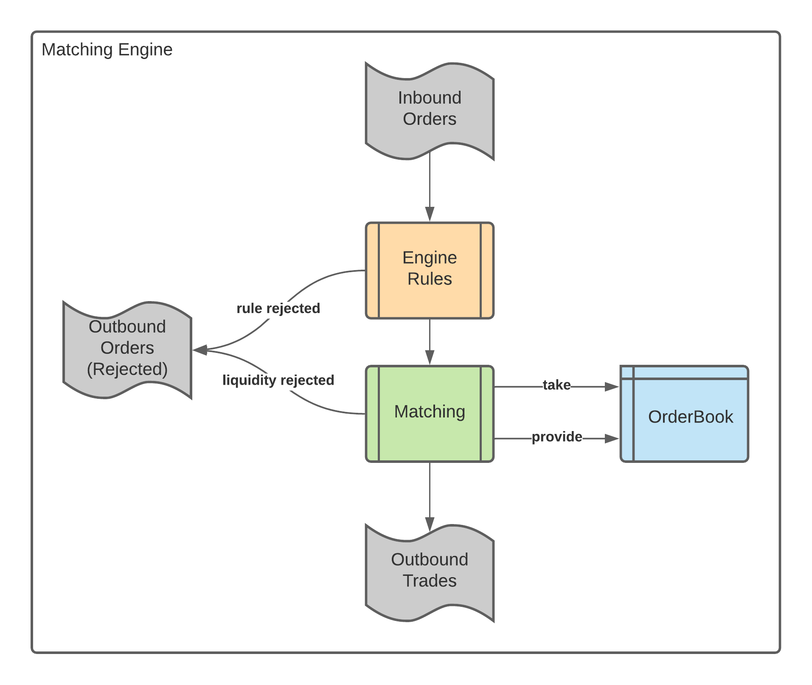
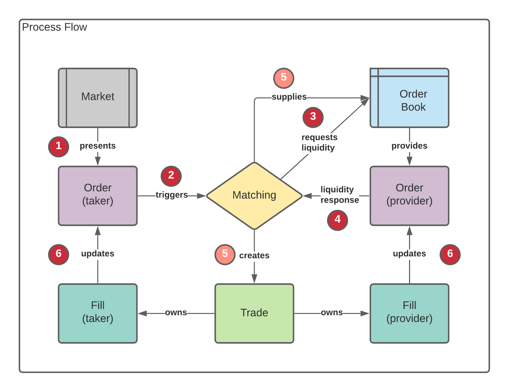

# matching
 THA Matching Engine

#### Main-Class: org.bryan.schorn.tha.matching.MEService
#### Working-Directory: src/main/resources
#### Configuration: src/main/resources/application.properties
#### Input-Files: symbols.csv orders1.csv
#### Output-Files: trades.txt rejected.txt orderbook.txt

